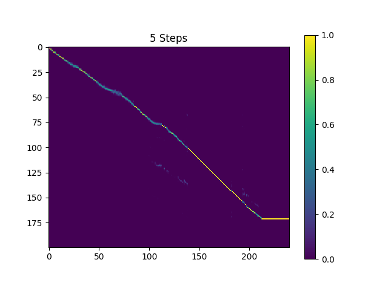

# Bangla-Speech-Emotion
This is a repository for our Bangla Text to speech NLP work

The pytorch implementation of papar [Efficiently Trainable Text-to-Speech System Based on Deep Convolutional Networks with Guided Attention](https://arxiv.org/abs/1710.08969).

This is out Short Notes pn the paper and the Code and works(Continued.....) [Bangla TTS with Guided Attention Notes](https://www.notion.so/Bangla-TTS-with-Guided-Attention-Notes-d6dcbf1925d14852886f12176767054a)

# Dataset
- [The LJ Speech Dataset](https://keithito.com/LJ-Speech-Dataset/). A public domain speech dataset consisting of 13,100 short audio clips of a single female speaker.
- [Open SLR - High quality TTS data for Bengali languages](http://www.openslr.org/37). A public domain speech dataset consisting of 10,100 short audio clips of a speaker.


# Train
We have tuned hyper parameters and trained a model with The LJ Speech Dataset and Open SLR Bangla Speech dataset. The hyper parameters may not be the best and are slightly different with those used in original paper.

To train a model yourself with The LJ Speech Dataset:

1. Download the dataset and extract into a directory, set the directory in `pkg/hyper.py`
2. Run preprocess
    ```
    python3 main.py --action preprocess
    ```
3. Train Text2Mel network, you can change the device to train text2mel in `pkg/hyper.py`
    ```
    python3 main.py --action train --module Text2Mel
    ```
4. Train SSRN network, also, it's possible to change the training device
    ```
    python3 main.py --action train --module SuperRes
    ```

# Samples
Some synthesized samples are contained in directory `synthesis`. The according sentences are listed in `sentences.txt`. The pre-trained model for Text2Mel and SuperRes (auto-saved at `logdir/text2mel/pkg/trained.pkg` and `logdir/superres/pkg/trained.pkg` in training phase) will be loaded when synthesizing.

You can synthesis samples listed in `sentences.txt` with
```
python3 main.py --action synthesis
```

- **Attention Matrix** for the sentence: *"অব্যবহৃত ইন্টারনেট ডেটা ফেরত না দেওয়া ও কল ড্রপ হওয়াসহ মোবাইল অপারেটরদের সেবার নিম্নমান নিয়ে অসন্তোষ প্রকাশ করেছেন ডাক ও টেলিযোগাযোগমন্ত্রী মোস্তাফা জব্বার।"*


# Pre-trained model
The samples in directory `synthesis` is sampled with 20k batches trained Text2Mel and 19k batches trained SuperRes.

The current result is not very satisfying, specificly, some vowels are skipped. Hope someone can find better hyper parameters and train better models. Please tell me if you were able to get a great model.

You can download the current pre-trained model from [our Gdrive](https://drive.google.com/drive/u/1/folders/1cO2kZsw_JJd-5AQbqZRUUgMGze1E58mY).

# Dependancy
- scipy, librosa, num2words, matplotlib
- PyTorch == 1.8.1
- CUDA 10.2
- numpy

# Relative
TensorFlow implementation: [Kyubyong/dc_tts](https://github.com/Kyubyong/dc_tts)

Please email [Sajid Ahmed](sajid.ahmed1@northsouth.edu) or [Arifuzzaman Arman](arifuzzaman.arman@northsouth.edu) to open an issue, if you have any question or suggestion.
